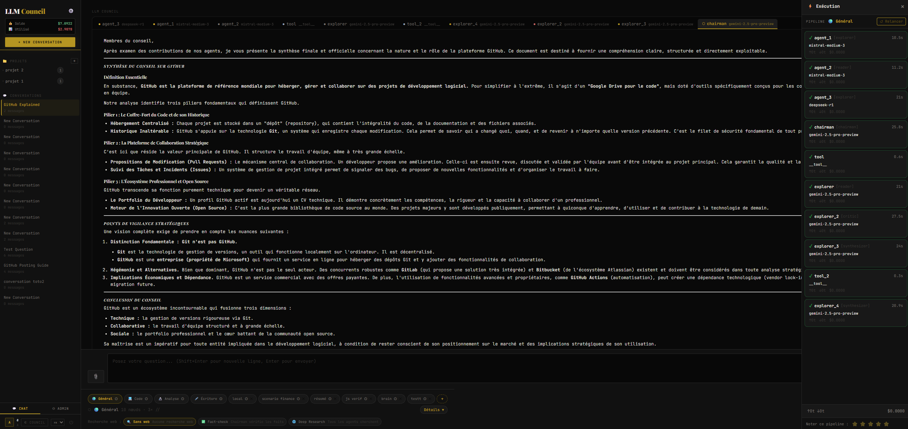
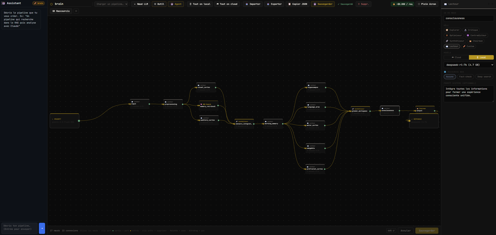
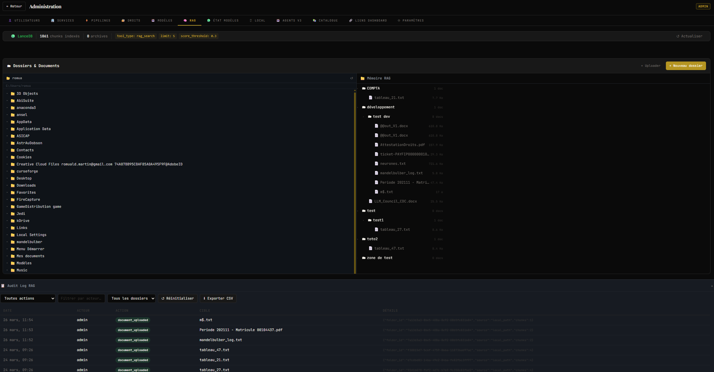

# LLM Council


> **Multi-LLM deliberation engine.**
> Instead of asking one model, ask a council. Models debate anonymously, rank each other, and a Chairman synthesizes the final answer.

---

## Why LLM Council?

Single-model responses have a fundamental flaw: one perspective, one bias, one blind spot.

LLM Council runs your query through a **3-stage deliberation process**:

1. **Stage 1 — Independent opinions**: Each council member answers independently
2. **Stage 2 — Anonymous peer review**: Models evaluate each other's responses without knowing who wrote what — eliminating favoritism
3. **Stage 3 — Chairman synthesis**: A designated model synthesizes all opinions and rankings into a final, deliberated answer

The result: answers that are more robust, more balanced, and more trustworthy than any single model can produce.

---

## Screenshots


*3-stage deliberation in action — 10 agents running in parallel, the Chairman (Gemini 2.5 Pro) synthesizes a structured final answer. Real-time execution trace on the right.*


*Visual DAG pipeline editor — 17 nodes, 22 connections. This "brain" pipeline was generated in natural language by the AI assistant in seconds. Export as `.cog` JSON and share.*


*Organizational memory — drag files from your PC directly into the RAG. 1861 chunks indexed, folder-level ACL permissions, 90-day audit log.*

---

## Quick Start

```bash
git clone https://github.com/totolarico702/llm-council.git
cd llm-council

# Copy and configure environment
cp .env.example .env
# Edit .env and set your OPENROUTER_API_KEY

# Install dependencies
uv sync
cd frontend && npm install && cd ..

# Start
./start.sh       # Linux/Mac
start.bat        # Windows
```

Open [http://localhost:5173](http://localhost:5173) — default credentials: `admin` / `admin`

> ⚠️ You will be forced to change the password on first login.

---

## Docker *(coming soon)*

```bash
# Docker image will be published on Docker Hub shortly
docker run -d \
  -p 8001:8001 \
  -p 8002:8002 \
  -e OPENROUTER_API_KEY=sk-or-v1-... \
  -v llmcouncil_data:/app/data \
  llmcouncil/council:latest
```

---

## API

### Deliberate

```bash
curl -X POST http://localhost:8001/api/v1/deliberate \
  -H "Authorization: Bearer llmc_your_api_key" \
  -H "Content-Type: application/json" \
  -d '{
    "input": {
      "message": "What is the best architecture for a high-traffic API in 2026?",
      "context": "Optional context injected by the caller (RAG content, documents, etc.)"
    },
    "cog": {
      "cog_version": "2.0",
      "council": {
        "models": [
          "mistralai/mistral-medium-3",
          "anthropic/claude-sonnet-4-5",
          "openai/gpt-4o"
        ],
        "chairman": "mistralai/mistral-medium-3",
        "anonymize": true
      },
      "config": {
        "language": "en",
        "timeout_global": 300
      }
    },
    "options": {
      "stream": false
    }
  }'
```

**Response:**
```json
{
  "id": "deliberation_abc123",
  "status": "completed",
  "result": {
    "stage1": [
      { "model": "mistralai/mistral-medium-3", "response": "..." },
      { "model": "anthropic/claude-sonnet-4-5", "response": "..." },
      { "model": "openai/gpt-4o", "response": "..." }
    ],
    "stage2": [
      { "model": "mistralai/mistral-medium-3", "rankings": [2, 1, 3] }
    ],
    "stage3": {
      "model": "mistralai/mistral-medium-3",
      "response": "Based on the council's deliberation..."
    }
  },
  "cost": { "total_usd": 0.0042 },
  "duration_ms": 4200
}
```

### Streaming (SSE)

```bash
curl -X POST http://localhost:8001/api/v1/deliberate \
  -H "Authorization: Bearer llmc_your_api_key" \
  -d '{ ..., "options": { "stream": true } }'
```

```
data: {"type": "node_start", "node_id": "llm_1", "label": "Explorer"}
data: {"type": "token", "node_id": "llm_1", "content": "The best architecture..."}
data: {"type": "node_done", "node_id": "llm_1", "duration_ms": 1240}
data: {"type": "stage_complete", "stage": 1}
data: {"type": "chairman_token", "content": "In synthesis..."}
data: {"type": "done", "cost": {"total_usd": 0.0042}}
```

### Other endpoints

```
POST   /api/v1/cog/validate          # Validate a .cog pipeline
POST   /api/v1/cog/estimate          # Estimate cost before running
GET    /api/v1/models                # Available models (OpenRouter + local Ollama)
GET    /api/v1/health                # Service health
GET    /api/v1/deliberations/{id}    # Retrieve past deliberation
```

---

## MCP Server

LLM Council exposes a **Model Context Protocol (MCP) server** on port 8002.
Plug it directly into Claude Desktop, Cursor, or any MCP-compatible tool.

### Claude Desktop configuration

Add to your `claude_desktop_config.json`:

```json
{
  "mcpServers": {
    "llm-council": {
      "command": "docker",
      "args": [
        "run", "--rm",
        "-e", "OPENROUTER_API_KEY=sk-or-v1-...",
        "-e", "MCP_TRANSPORT=stdio",
        "llmcouncil/council:latest",
        "python", "-m", "backend.mcp_server"
      ]
    }
  }
}
```

### Available MCP tools

| Tool | Description |
|------|-------------|
| `deliberate` | Submit a question to the council |
| `validate_cog` | Validate a .cog pipeline definition |
| `list_pipelines` | List saved pipelines |
| `estimate_cost` | Estimate cost before running |

---

## The .cog Format

Pipelines are defined in `.cog` — a JSON grammar for cognitive workflows.

```json
{
  "cog_version": "2.0",
  "name": "Competitive Analysis",
  "council": {
    "models": [
      "mistralai/mistral-medium-3",
      "anthropic/claude-sonnet-4-5"
    ],
    "chairman": "openai/gpt-4o",
    "anonymize": true
  },
  "nodes": [
    { "id": "input", "type": "input", "label": "User query" },
    { "id": "analyst_1", "type": "llm", "model": "mistralai/mistral-medium-3",
      "system_prompt": "You are a market analyst..." },
    { "id": "analyst_2", "type": "llm", "model": "anthropic/claude-sonnet-4-5",
      "system_prompt": "You are a competitive intelligence expert..." },
    { "id": "merge", "type": "merge", "strategy": "concatenate" },
    { "id": "output", "type": "output", "label": "Final synthesis" }
  ],
  "edges": [
    { "from": "input", "to": "analyst_1" },
    { "from": "input", "to": "analyst_2" },
    { "from": "analyst_1", "to": "merge" },
    { "from": "analyst_2", "to": "merge" },
    { "from": "merge", "to": "output" }
  ],
  "config": {
    "language": "en",
    "timeout_global": 300
  }
}
```

### Supported node types

| Type | Description |
|------|-------------|
| `input` | Entry point |
| `output` | Exit point |
| `llm` | Cloud LLM (via OpenRouter) |
| `llm_local` | Local LLM (via Ollama) |
| `rag_search` | Vector search (inject external context) |
| `tool` | Web search, fact-check |
| `mcp` | External MCP server call |
| `condition` | Conditional branching |
| `merge` | Multi-output fusion |
| `inject` | Inject external context |
| `transform` | Transform output with template |

---

## Pipeline Editor

LLM Council ships with a **visual pipeline editor** at `http://localhost:5173`.

- Drag & drop DAG builder with PROMPT → nodes → RESPONSE flow
- **AI assistant**: describe a pipeline in natural language → generates `.cog` instantly
- Export/import `.cog` files — share pipelines as JSON
- Real-time cost estimation per node
- Keyboard shortcuts (`Ctrl+S` save, `Ctrl+D` duplicate, `Ctrl+E` export, ...)
- **Caféine mode**: mandatory human validation before the Chairman's answer is sent

---

## Configuration

```env
# Required
OPENROUTER_API_KEY=sk-or-v1-...

# Optional
OLLAMA_URL=http://localhost:11434       # Local models
JWT_SECRET=change-me-in-production
PRODUCTION=0
```

Full `.env.example` included in the repository.

---

## Development Setup

```bash
git clone https://github.com/totolarico702/llm-council.git
cd llm-council

# Backend
cp .env.example .env
uv sync
uv run python -m backend.main

# Frontend (separate terminal)
cd frontend
npm install
npm run dev
```

---

## Tech Stack

| Layer | Technology |
|-------|-----------|
| Backend | FastAPI (Python 3.10+) |
| Frontend | React 18 + Vite |
| Storage | TinyDB + LanceDB |
| LLM routing | OpenRouter API |
| Local LLMs | Ollama |
| MCP | FastMCP |
| Auth | JWT httpOnly cookies + API keys |
| Deployment | Docker *(coming soon)* |

---

## Roadmap

- [x] **V1** — Multi-LLM deliberation, 3-stage process
- [x] **V2** — DAG engine, RAG, Pipeline Editor, .cog grammar, Caféine mode
- [x] **V3** — REST API, MCP server, Docker, .cog v2.0
- [ ] **V4** — Node advisor (recommends best model per task), agent catalog, inter-agent communication

---

## License

MIT License — free for personal and commercial use.

---

## Author

Built by [Romuald Martin](https://github.com/totolarico702) / [Cabin Skolar](https://cabinskolar.fr)

*If you find this useful, a ⭐ on GitHub goes a long way.*
